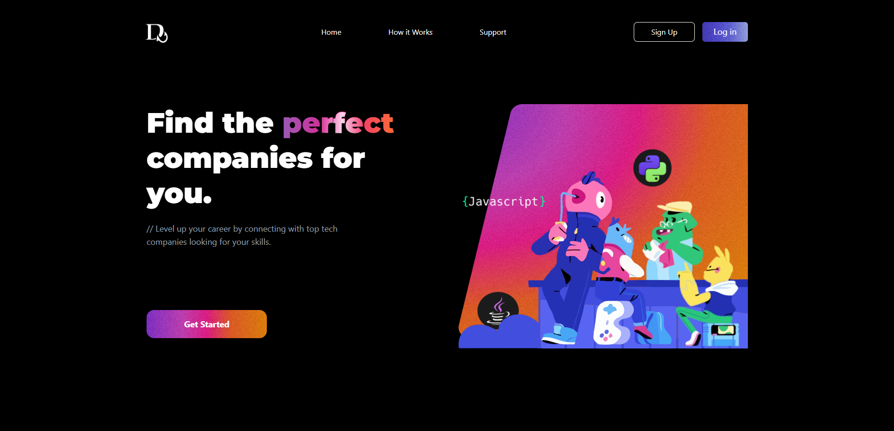

<div align="center">
 
</div>

<div align="center">
 <br \>
 <br \>
 <br \>
 </img>
 <h3><strong>DevHook</strong></h3>
 <p>Website ficticio de busca de emprego para coders</p>
</div>

---

## Sobre o Projeto

**DevHook** é um projeto da faculdade focado em transformar uma prorotipagem criada no figma em um site estático funcional.
A principal proposta do website é ser uma alternativa ao já conhecido **Linked-In**, porém focado apenas para desenvolvedores.
Você pode acessar uma demonstração do site **NÃO FUNCIONAL** <a href="https://dev-hook.vercel.app">aqui</a>


---

## Ferramentas utilizadas

<div align="center">
 
### ▼ Frontend


Além das ferramentas, foi utilizado designs do <a href="https://www.discord.com">Discord</a>. <br/>
e alguns componentes do website <a href="https://reactbits.dev">ReactBits</a>.
</div>

---

## Instalação e Execução

### ➤ Instalação padrão

```bash
# Clone o repositório
git clone https://github.com/whoisleoo/Dev-Hook

# Entre no diretório frontend
cd devhook

# Instale as dependências
npm install

# Inicie o projeto
npm run dev

# Acesse o website
https://localhost:5173

````

---

## Colaboradores do projeto

<div align="center">
➤ <a href="https://github.com/whoisleoo">whoisleoo</a>
<br/>
<br/>
➤ <a href="https://github.com/niyjn">gabster</a>
</div>


